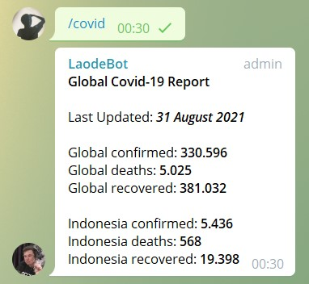
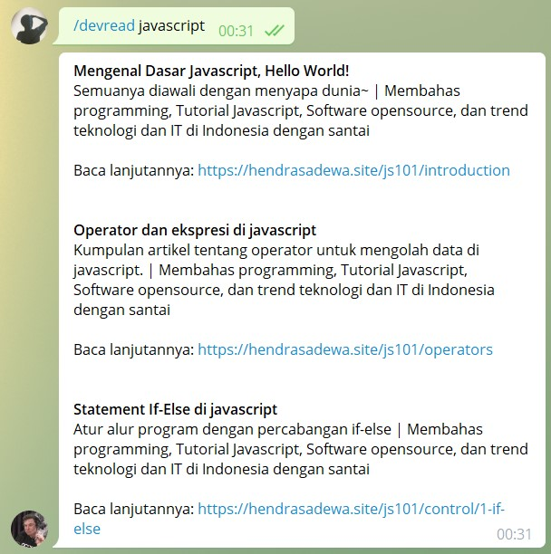
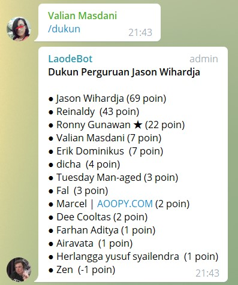
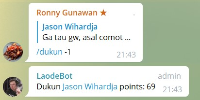
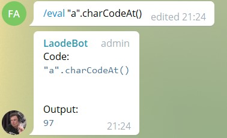
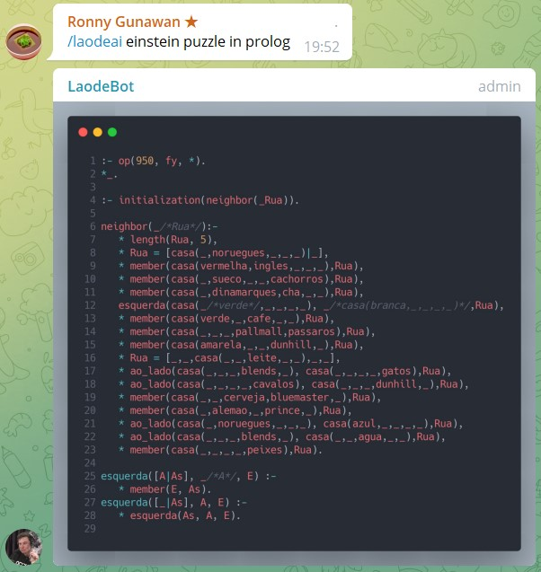

# Usage Guide

> Klik disini untuk [dokumentasi penggunaan namun dalam Bahasa Indonesia](./USAGE_id.md)

In this document you will find how to use Teknologi Umum Bot. Its' commands and available parameters.

## Contents

- 💙 [`/blidingej`](#-blidingej)
- 💙 [`/quiz`](#-quiz)
- 🌏📬 [`/covid`](#-covid)
- 🌏📬 [`/devread`](#-devread)
- 🌏 [`/dukun`](#-dukun)
- 🌏📬 [`/eval`](#-eval)
- 🌏📬 [`/search`](#-search)
- 🌏📬 [`/snap`](#-snap)
- 🌏📬 [`/help`](#-help)
- 🛩📬 [`/kktbsys`](#-kktbys)
- 🛩📬 [`/illuminati`](#-illuminati)
- 🛩📬 [`/joke`](#-joke)
- 🛩📬 [`/quote`](#-quote)
- 🛩📬 [`/yntkts`](#-yntkts)
- 🛩📬 [`/hilih`](#-hilih)
- 🌏📬 [`/laodeai`](#-laodeai)

Legends:

- 💙 Teknologi Umum group only
- 🌏 Available on groups
- 🛩 Available on groups less than 500 members
- 📬 Available on private chats
- 🚧 Experimental feature
- 🚨 Deprecated

## `/blidingej`

Will send you the definition of bliding ej.

Available only on Teknologi Umum Group.

- `/blidingej`
- `/blidingej indo` or `/blidingej id` - Indonesian translation

## `/quiz`

Will send you a random quiz. Whether it'd be TOKI, general programming, or some tech-related trivia.

Available only on Teknologi Umum Group.

- `/quiz`

## `/covid`

Will send you Covid-19 statistic information

- `/covid` - Global & Indonesia statistic
- `/covid <country>` - That specific country statistic

## `/devread`

Will send you a collection of developer articles and posts around a certain topic from pulo.dev.

- `/devread <topic>`

## `/dukun`

Dukun is an Indonesian term for shaman or sorcerer.
It's kind of a joke for specifying those who could answer a given problem without any details about it whatsoever.

Not available on private chats.

Reply to other person's message with `/dukun +<point>` or `/dukun -<point>` to give them a dukun point.
Maximum point given for a person is +10 and -10.

Be careful of using this, it's a competitive life.

- `/dukun` - Shows dukun leaderboard
- `/dukun +<point>` - Increment someone's dukun point
- `/dukun -<point>` - Decrement someone's dukun point

## `/eval`

Evaluate javascript expression and shows the output. Bear in mind we limit the usage of a lot of stuff.
If you want to produce more powerful things, please create it on [JSBin](https://jsbin.com/),[JSFiddle](http://jsfiddle.net/),
[Codepen](https://codepen.io/), [Codesandbox](https://codesandbox.io/), or even [Repl.it](https://repl.it/).

- `/eval <javascript expression>`

## `/search`

Shows you 10 results from a DuckDuckGo search. As simple as that. No ads. Filtered clean search results by the algorithm.

- `/search <query>`

## `/snap`

Snap a given code snippets with [Carbon.now.sh](https://carbon.now.sh/).

Send a code snippet, and reply to that message with `/snap`. You will get the code captured and served beautifully.

- `/snap`

## `/help`

Gives information about the bot

- `/help`

## `/kktbsys`

Sends you a Soeharto's "Kok kamu tanya begitu, siapa yang suruh?" meme.

Only available in groups less than 500 members and private chats.

- `/kktbsys`

## `/illuminati`

Sends you an illuminati GIF.

Only available in groups less than 500 members and private chats.

- `/illuminati`

## `/joke`

Sends you a random Indonesian dad jokes in picture format.

Only available in groups less than 500 members and private chats.

- `/joke`

## `/quote`

Sends you a random quote from someone famous. Or at least, the API think they are famous.

Only available in groups less than 500 members and private chats.

- `/quote`

## `/yntkts`

Sends you a Jokowi's "Yo ndak tahu kok tanya saya" meme.

Only available in groups less than 500 members and private chats.

- `/yntkts`

## `/hilih`

Sends you a Chef Arnold Poernomo's "hilih" meme.

Only available in groups less than 500 members and private chats.

- `/hilih`

## `/laodeai`

Sends you his (yes, it's a HE) own answer of your problem.

- `/laodeai <query>`

